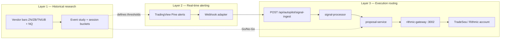

# Bond ATR Spike → NQ Contrarian — Feasibility Report

**Ticket:** S75-T6
**Date:** 2026-05-22
**Author:** Codi (research spike)
**Account / feed context:** TradeSea (desk UI + account workflow) on **Rithmic** data, market access, and execution
**Status:** Architecture and study design only — no trades, no code changes, no live data pull in this spike

---

## Executive recommendation

### **Needs Data**

Fintheon has a viable **routing shell** (TradingView or QuantConnect → `/api/autopilot/signal-ingest` → proposal → Rithmic gateway) but **no evidence yet** that bond ATR spikes predict contrarian NQ edges after costs. Treat **Go** as blocked until:

1. A reproducible historical study (design below) completes on aligned ZN/ZB/TN/UB + NQ/MNQ series.
2. TradeSea/Rithmic credentials and symbol mapping are verified for the execution symbol (MNQ vs NQ).
3. TradingView alert definitions are frozen to match the study’s bar logic (no definition drift).

**No-Go triggers (post-study):** hit rate &lt; 52% at 1:1.5 R:R after slippage, negative expectancy on primary session bucket, or &gt; 40% false-positive rate in the NQ contrarian window.

---

## Problem statement

Test whether **Treasury futures ATR/range expansion spikes** reliably **lead** short-horizon **contrarian** NASDAQ futures setups, and whether Fintheon can operationalize that as:

1. Offline historical timing research
2. Real-time spike alerts (prefer TradingView if study passes)
3. Proposal-only execution via existing Autopilot + Rithmic, with hard risk gates

---

## Three-layer architecture (must stay separated)



| Layer | Purpose | Fintheon touchpoints | Out of scope for spike |
|-------|---------|----------------------|-------------------------|
| **1 — Historical** | Prove lead/lag, expectancy, session stability | None required (Jupyter/QC/CSV) | Live orders |
| **2 — Alerting** | Fire when bond ATR spike condition is true | TV webhook → adapter → `signal-ingest` | Auto-execute |
| **3 — Execution** | Human or gated auto after proposal + risk | `proposal-service` → `rithmic-service` | TradeSea iframe as API |

**TradeSea** is the trader-facing account surface (embedded in `TradingBrowser` / Electron). **Execution is not TradeSea HTTP** — it is `PRIMARY_BROKER=rithmic` → `rithmic-gateway` per `docs/quantconnect/RITHMIC-GATEWAY.md`. Do not conflate TradeSea UI login with signal or order APIs.

---

## TradingView alerts vs direct Rithmic market data

| Criterion | TradingView alerts | Direct Rithmic (TICKER_PLANT / gateway extension) |
|-----------|-------------------|---------------------------------------------------|
| **Spike detection** | Sufficient **if** Pine logic mirrors Layer 1 bar rules (`barstate.isconfirmed`, same ATR length/threshold) | Required only for **sub-bar** or **tick-velocity** triggers |
| **Latency** | Typically 1–30s (alert → webhook → Fintheon) | Sub-second once TICKER_PLANT exists (listed Phase 2 gap in RITHMIC-GATEWAY.md) |
| **Repainting risk** | Mitigate with `alert(..., alert.freq_once_per_bar_close)` | N/A — exchange timestamps |
| **Bond symbols** | CME continuous / front-month TV symbols (`CBOT:ZN1!`, etc.) | Must map Rithmic symbol table for TradeSea account |
| **Operational cost** | TV Pro alerts + webhook URL | Gateway uptime + Rithmic entitlements |

**Conclusion:** For this strategy’s **proposed bar-based ATR spike**, **TradingView alerts are enough for real-time detection** provided Layer 1 uses the **same** bar construction. **Direct Rithmic MD is not required for MVP**; add it only if the study shows edge in the first 30–60s after spike and TV latency erodes expectancy.

---

## Layer 1 — Historical study design (exact)

### Instruments

| Role | Symbols | Notes |
|------|---------|--------|
| **Triggers (test each)** | **ZN** (10Y), **ZB** (30Y), **TN** (Ultra 10Y), **UB** (Ultra 30Y) | Run **per-contract** leaderboards; optional composite “first spike among {ZN,ZB,TN,UB}” secondary |
| **Execution leg** | **NQ** primary; **MNQ** for slippage/fee sensitivity | Same timestamps, scale costs |
| **Control** | **ES** | Optional sanity check (macro beta vs NQ-specific) |

Use **continuous back-adjusted** series or roll-aware front-month from a single vendor (QuantConnect Lean, Norgate, or Rithmic-exported bars). **Do not mix vendors** across trigger and target legs.

### Calendar and sessions (America/New_York)

| Bucket | ET window | Rationale |
|--------|-----------|-----------|
| **Globex overnight** | 18:00–08:00 (prior day 18:00 → day 08:00) | Bond flow outside cash |
| **London handoff** | 03:00–05:00 | European close / US pre-open |
| **US pre-market** | 08:00–09:30 | Treasury auctions, European spill |
| **US RTH** | 09:30–16:00 | Primary NQ liquidity |
| **Lunch** | 11:30–13:00 | Lower NQ participation |
| **Power hour** | 15:00–16:00 | Close dynamics |

**RTH-only variant:** Repeat primary metrics on 09:30–16:00 only.

**Regular hours for bonds:** CME Treasury futures trade nearly 23h; align bond bars to **full Globex** for trigger detection, but tag each event with session bucket for stratified results.

### Bar timeframes

| Series | Timeframes | Use |
|--------|------------|-----|
| **Trigger (bond)** | **1m** (primary), **5m** (robustness) | Spike detection |
| **Target (NQ)** | **1m** | Contrarian outcome measurement |
| **Context** | **15m** | Trend filter optional (NQ 15m EMA slope ≠ flat) |

### ATR and spike definitions

**ATR:** Wilder **ATR(14)** on bond bars (same as TradingView `ta.atr(14)`).

**Bar range:** `range_t = high_t - low_t` (not close-to-close).

**Spike threshold options (run all three in grid):**

| ID | Condition | Interpretation |
|----|-----------|----------------|
| **S1** | `range_t > 1.5 × ATR14_t` | Moderate expansion |
| **S2** | `range_t > 2.0 × ATR14_t` | Strong expansion |
| **S3** | `range_t > 2.5 × ATR14_t` | Extreme expansion |

**Cooldown:** After a spike, suppress new triggers on same bond for **15 minutes** (1m bars) / **3 bars** (5m bars).

**Directional bond move (for stratification, not gating):**

- **Bond up:** `close_t > close_{t-1}` and spike fired
- **Bond down:** `close_t < close_{t-1}` and spike fired

Hypothesis families to test:

- **H1 (macro contrarian):** Bond up spike → NQ was selling → **long NQ** within window
- **H2 (impulse fade):** Bond spike in either direction → **fade first NQ impulse** in first 5m after `t0`

Report both; pick winner by expectancy in RTH bucket.

### NQ contrarian window (outcome)

Let **`t0`** = bar close time of bond spike bar.

| Parameter | Value |
|-----------|--------|
| **Lead study** | Measure NQ return from **`t0 − 15m` to `t0`** (did NQ move before bond?) |
| **Lag entry** | Earliest entry **`t0 + 1m`** (no same-bar lookahead) |
| **Hold / measure window** | **`t0 + 1m` → `t0 + 30m`** (primary); robustness **`+15m`**, **`+60m`** |
| **Contrarian direction** | Opposite sign of NQ **1m return from `t0−5m` to `t0`** (fade the pre-spike NQ drift) |
| **Stop (study)** | 0.75 × bond spike bar range mapped to NQ points via rolling beta (60×1m) or fixed **40 NQ pts** MNQ-equivalent |
| **Target (study)** | 1.5R and 2R; time stop at window end |

### Econ print exclusions

Exclude triggers and entries when **`t0`** falls in:

| Rule | Detail |
|------|--------|
| **Scheduled high-impact** | **`t0` ∈ [release − 5m, release + 15m]** for events in Fintheon `economic_events` / desk calendar with impact **high** (or `macroLevel >= 3` in RiskFlow taxonomy) |
| **FOMC / CPI / NFP / Powell** | Hard exclude **±30m** |
| **Pre-staged news** | Exclude if `scored_riskflow_items.iv_score >= 8.5` within **10m** (aligns with Arbitrum chamber trigger threshold) |

Source of truth for calendar: Supabase `economic_events` + desk ICS ingest — **export once** into study DB; do not assume TV calendar alone.

### Cost model (required for “after fees” question)

| Item | Assumption |
|------|------------|
| **Commissions** | MNQ round-turn **$1.00–$1.50** (configurable per TradeSea plan) |
| **Slippage** | **2 ticks** entry + **2 ticks** exit on MNQ (1 tick = 0.25 pt) |
| **Spread** | **1 tick** half-spread on entry |
| **Alert lag penalty** | +**1 tick** adverse on entries fired &gt; 10s after `t0` (TV path stress test) |

### Metrics (report per bond × threshold × session bucket)

| Metric | Definition |
|--------|------------|
| **Hit rate** | % trades reaching 1R before stop |
| **Expectancy** | Mean R per trade after costs |
| **MAE** | Max adverse excursion in window (pts) |
| **MFE** | Max favorable excursion |
| **Time-to-1R** | Median minutes from entry |
| **False-positive rate** | Spike with no NQ move ≥ **15 pts** within 30m |
| **Lead time** | Distribution of peak \|NQ move\| relative to `t0` |
| **Sample count** | Raw triggers and tradable (post-exclusion) |

### Minimum sample size

| Level | Requirement |
|-------|-------------|
| **Per bond × S2 threshold × US RTH** | **≥ 200** tradable events |
| **Full grid (4 bonds × 3 thresholds × 6 buckets)** | Descriptive only until primary cell hits 200 |
| **Go bar** | Primary cell expectancy **&gt; 0.15R** after costs, **≥ 200** samples, hit rate **≥ 52%** at 1.5R target |

Study window: **minimum 24 months** of 1m data (include at least one high-vol regime).

### Deliverables from Layer 1

1. CSV or notebook: event list with `t0`, bond, threshold, session, NQ path
2. Table: expectancy by bucket
3. Recommended single bond + threshold + session filter for Layer 2
4. Written **Go / No-Go / Needs Data** update (this doc’s recommendation stays **Needs Data** until that table exists)

---

## Layer 2 — TradingView alerting

### Pine alignment checklist

- `atrLen = 14`, spike uses **high−low** vs `ta.atr(atrLen)`
- `alert.freq_once_per_bar_close` only
- Emit **bond symbol**, **timeframe**, **threshold id (S1/S2/S3)**, **bond direction**, **bar close time ISO**
- Mirror **cooldown** (15m) in Pine `var` state

### Proposed webhook JSON payload

TradingView’s `{{strategy.order.alert_message}}` or alert message field should carry JSON (adapter parses):

```json
{
  "source": "tradingview",
  "strategy": "BOND_ATR_NQ_CONTRARIAN",
  "triggerInstrument": "ZN",
  "triggerExchange": "CBOT",
  "timeframe": "1",
  "atrLookback": 14,
  "spikeThresholdId": "S2",
  "atrMultiple": 2.0,
  "bondDirection": "up",
  "spikeBarHigh": 112.25,
  "spikeBarLow": 112.02,
  "spikeBarClose": 112.20,
  "spikeBarTime": "2026-05-22T14:35:00-04:00",
  "alertFiredAt": "2026-05-22T14:36:02-04:00",
  "suggestedExecutionInstrument": "MNQ",
  "suggestedDirection": "long",
  "confidence": 65,
  "signals": ["bond_atr_spike", "nq_fade_setup"],
  "sessionWindow": "US_RTH",
  "notes": "Contrarian leg derived from Pine; confirm in Fintheon proposal UI"
}
```

### Webhook routing (recommended)

| Option | Verdict |
|--------|---------|
| **A — Extend `/api/autopilot/signal-ingest`** | **Preferred** after thin **TradingView adapter** maps JSON → `SignalEvent` |
| **B — New `/api/autopilot/tradingview-webhook`** | Use if shared secret / HMAC validation needed (TV cannot send Supabase JWT) |
| **C — Staging-only research endpoint** | Only for replay/logging during study; not production |

**Current `SignalEvent` shape** (`backend-hono/src/types/agents.ts`):

- Requires: `source`, `strategy`, `direction`, `instrument`, `confidence`, `entryPrice`, `stopLoss`, `takeProfit[]`, `signals[]`, `timestamp`
- `strategy` must be an allowed `TradingStrategy` registry value — **`BOND_ATR_NQ_CONTRARIAN` does not exist yet** (action item)

**Adapter responsibilities:**

1. Validate shared secret header (env `TV_WEBHOOK_SECRET`) — not implemented today
2. Map `suggestedDirection` → `direction`, `suggestedExecutionInstrument` → `instrument`
3. Set `entryPrice` / `stopLoss` from **last NQ quote** via `tradingview/scanner.ts` or Rithmic mid — **prerequisite: live quote**
4. Set `confidence` from study tier (fixed table) not TV’s subjective score
5. Never set confidence ≥ 80 for this strategy until forward paper passes (avoids fast-path auto-execute)

**Public route note:** `signal-ingest` is registered **without auth** (see `backend-hono/src/routes/index.ts` comment: QC/TV webhooks). **Must add webhook secret** before exposing to internet.

---

## Layer 3 — Execution routing (Fintheon today)

### Existing path (verified in repo)

```
TradingView / QC / manual
  → POST /api/autopilot/signal-ingest
  → processSignal() [signal-processor.ts]
       ├─ confidence ≥ 80 → fast path (risk assess → createProposal → may auto-execute)
       └─ else → full agent pipeline
  → acknowledge (human) → POST /api/autopilot/execute
  → proposal-service → rithmic-service → localhost:3002/order/place
```

**Relevant constants today (`signal-processor.ts`):**

- `MAX_TRADES_PER_DAY = 3`
- `HIGH_CONFIDENCE_THRESHOLD = 80` → fast path
- `AUTO_EXECUTE_RISK_THRESHOLD = 0.3` → can auto-execute without UI

**Global strategy catalog** (`STRATEGY-INDEX.md`): NAS100 intraday only; **no bond-trigger strategy**.

**Guardian** (`guardian.ts`): mechanical pause — 3% drawdown cap, position notional cap, 10m cooldown.

**Rithmic gateway gaps** (RITHMIC-GATEWAY.md Phase 2): bracket orders, fill webhooks, **TICKER_PLANT**, PNL_PLANT.

### Proposed strategy-specific gates (must override defaults)

| Gate | Setting |
|------|---------|
| **Phase 0** | Signals **log-only** (adapter writes to signal log, no `createProposal`) |
| **Phase 1 — Paper** | `createProposal` only; **no** `executeProposal`; TradeSea/Rithmic **paper** system name |
| **Phase 2 — Proposal-only live** | Human ack required; disable auto-execute for `BOND_ATR_NQ_CONTRARIAN` regardless of confidence |
| **Phase 3 — Conditional auto** | Only if forward paper **≥ 30 sessions**, expectancy &gt; 0, and TP enables `AUTOPILOT_MODE=autonomous` with strategy allowlist |

| Check | Source |
|-------|--------|
| Daily loss limit | User settings / `AUTOPILOT_DAILY_LOSS_LIMIT` (planned in RITHMIC-GATEWAY.md) + guardian drawdown |
| Max trades | Keep ≤ **2/day** for this strategy (stricter than global 3) |
| Lockout | PsychAssist + risk-manager rejection |
| Account state | `GET /status` on rithmic-gateway before execute; block if disconnected |
| Econ proximity | Reuse watchouts / blindspots “no entry ±5m high-impact” |
| Session | Reject outside study-winning bucket (e.g. US RTH only) |

---

## Staged implementation plan

| Stage | Work | Exit criteria |
|-------|------|---------------|
| **0 — Study** | Run Layer 1 grid; pick bond + S* + session | Written Go/No-Go with 200+ samples |
| **1 — TV Pine + paper alerts** | Pine + webhook to **staging** ingest | 2 weeks alert logs match offline replay ≥ 95% |
| **2 — Adapter + proposal-only** | Map webhook → `SignalEvent`; add strategy registry value; **force full path** or cap confidence &lt; 80 | Proposals appear in UI; zero executions |
| **3 — Forward paper** | Simulate fills with slippage model or Rithmic paper | 30 sessions, positive expectancy |
| **4 — Live proposal** | TradeSea desk + Rithmic live with human ack | TP sign-off |
| **5 — Optional auto** | Strategy allowlist + lowered auto threshold only if Stage 3 passes | Guardian + daily loss unchanged |

**Do not** enable `executeProposal` auto-path for this strategy in Stages 0–3.

---

## Validation notes (this spike)

| Check | Result |
|-------|--------|
| Read AGENTS.md, CLAUDE.md, WORKSPACE.md, `.cursor/rules/` | Done |
| Read RITHMIC-GATEWAY.md, STRATEGY-INDEX.md, signal-ingest, signal-processor | Done |
| Live / paper orders | **Not run** |
| Source code changes | **None** (report only) |
| `git diff --check` | Run at spike completion |

---

## Action items (prerequisites — not success)

### Data and research

- [ ] License and load **24+ months** of 1m bars for ZN, ZB, TN, UB, NQ (and MNQ), single vendor
- [ ] Export Fintheon **high-impact econ calendar** into study DB with ±5m/±30m exclusion columns
- [ ] Execute Layer 1 grid; publish expectancy table and update recommendation to Go or No-Go
- [ ] Document roll schedule and continuous vs front-month choice

### Account / env / infrastructure

- [ ] Confirm **TradeSea** account is active on **Rithmic** with **MNQ/NQ** and bond symbols entitled
- [ ] Verify `rithmic-gateway` `/status` connected to intended system (paper vs live)
- [ ] Set `RITHMIC_GATEWAY_URL` in backend (no secret values in repo)
- [ ] Map Rithmic symbol roots (ZN, ZB, etc.) — gateway today accepts `symbol` + `exchange: CME`

### Product / code (post-Go only)

- [ ] Add `BOND_ATR_NQ_CONTRARIAN` to the trading strategy registry and STRATEGY-INDEX
- [ ] Implement TradingView webhook adapter + `TV_WEBHOOK_SECRET`
- [ ] Block auto-execute for this strategy in `processSignal` / fast path
- [ ] Add strategy-level max trades and session filter
- [ ] Optional: TICKER_PLANT subscription in gateway for latency-sensitive Phase 5

### TradingView

- [ ] Publish Pine with frozen parameters from winning study cell
- [ ] Configure alert webhook URL (staging first)
- [ ] Prove bar-close alerts match offline spike count (daily reconciliation script)

---

## References (in-repo)

| Path | Relevance |
|------|-----------|
| `sprint-md/S75-T6-bond-atr-nq-contrarian-feasibility.md` | Ticket brief |
| `docs/quantconnect/RITHMIC-GATEWAY.md` | Execution stack, Phase 2 MD gaps |
| `docs/autopilot-strategies/STRATEGY-INDEX.md` | Existing NAS100 strategies |
| `backend-hono/src/routes/autopilot/signal-ingest.ts` | Ingest handler |
| `backend-hono/src/services/autopilot/signal-processor.ts` | Fast/full path, daily limits, auto-execute |
| `backend-hono/src/types/agents.ts` | `SignalEvent`, `TradingStrategy` |
| `backend-hono/src/services/rithmic-service.ts` | Gateway client |
| `frontend/components/TradingBrowser.tsx` | TradeSea embed (desk, not order API) |

---

## Summary

| Question | Answer |
|----------|--------|
| Can Fintheon route this? | **Yes**, via existing autopilot + Rithmic gateway after adapter and strategy registry work |
| Is the edge proven? | **No** — **Needs Data** |
| TV enough for spikes? | **Yes for bar-based MVP**; Rithmic MD optional until sub-minute edge proven |
| TradeSea role? | Account/desk context; execution remains **Rithmic** |
| Safe default? | **Proposal-only, no auto-execute**, paper before live |
