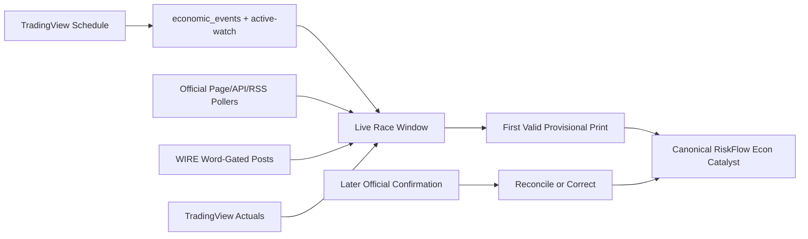

# Sprint Brief: S55 -- RiskFlow Feed Health + Econ Live Race (single-agent)

## Intent

Restore trust in RiskFlow before any larger agentic-runtime migration. When this is done, the feed must no longer show blocked publishers disguised as trusted sources, hidden/background writers must be identified and quarantined, WIRE econ/earnings prints must be classified by words rather than emoji assumptions, and TradingView must remain schedule-only while live prints are handled by a source-race model with provenance and reconciliation.

## Branch Target

`v.5.30.1-riskflow-feed-health-econ-race`

## Operator Context

TP observed four FinancialJuice econ prints, but RiskFlow produced zero catalyst cards. Live feed audit showed a bigger issue: the visible feed is polluted by blocked publishers labeled as trusted sources.

Observed live feed sample (`/api/riskflow/feed?limit=500`, 2026-04-30):

- `FinancialJuice`: 420 visible items, including 347 `seekingalpha.com`, 59 `bloomberg.com`, 10 `cnbc.com`, 4 `marketwatch.com`.
- `OSINTSources`: 19 visible items, including `bloomberg.com`, `seekingalpha.com`, `cnbc.com`, `marketwatch.com`.
- `EconomicCalendar`: 3 visible items, including `seekingalpha.com` and `bloomberg.com`.

This is a trust-label failure, not only an econ pipeline failure.

## Scope -- Included

- [ ] Audit and quarantine hidden/background writers that can mutate RiskFlow data or regress news-feed hardening.
- [ ] Purge existing poisoned rows from `raw_riskflow_items`, `scored_riskflow_items`, and narrative links where URL/domain matches blocked publishers.
- [ ] Add read-time blocked-host protection so poisoned historical rows cannot render even if they survive in the DB.
- [ ] Fix source normalization so unknown/untrusted sources never default to `FinancialJuice`.
- [ ] Preserve approved X/WIRE sources, but store provenance separately from rendered source bucket where possible.
- [ ] Replace FinancialJuice emoji-dependent live-print classification with WIRE word gates:
  - Econ: WIRE post contains both `Actual` and `Forecast`.
  - Earnings: WIRE post contains `EPS` and either `REV` or `Revenue`.
- [ ] Treat TradingView as schedule-only for `economic_events`, active-watch, agentic scheduling, and countdown windows.
- [ ] Implement an econ live-race service shape: scheduled event opens a window, official/WIRE/TradingView fallback observations race, first valid print is provisional, later authoritative source reconciles.
- [ ] Keep official source work bounded to registry/service scaffolding and fallback roles. Do not overclaim official latency until live stopwatch tests prove it.
- [ ] Move the Econ Status indicator from heading toolbar to footer toolbar.
- [ ] Create a compact heading-toolbar Econ Countdown widget modeled on `PsychAssistDockable` behavior: shared slot with PsychAssist, fade-in/fade-out handoff, country flag, event preview, forecast, countdown, actual, dismiss `X`.

## Scope -- Excluded (OUT OF BOUNDS)

- Hermes App-Native Runtime migration, DeepSeek/NOUS routing, MCP governance, and self-improving plugins. That is Wave 2 and should be handled by `/solvys-orchestrate` after this brief is sent off.
- Broad official-source production promotion without release-day stopwatch evidence.
- Reintroducing Rettiwt, Agent Reach, XActions, Nitter, MSM RSS, Exa news gathering, or any mainstream media fallback.
- Rebuilding the entire RiskFlow UI.
- Running a Vite dev server.

## Known Issues to Preserve

- Recent changelog entries intentionally stripped Rettiwt and Agent Reach from active RiskFlow paths. Do not re-enable them.
- TradingView is still valuable as the schedule/calendar source. Do not remove it from `economic_events`, active-watch, agentic context, or countdown scheduling.
- Existing official government RSS collector work should remain allowlist-first and deny-by-default.
- Existing blocked publisher policy should be strengthened, not weakened.
- Existing RiskFlow Refinement UI source grouping should stay: X handles and web sources remain separate.

## Critical Files To Read First

- `src/lib/changelog.ts`
- `backend-hono/src/services/riskflow/scorer-tagging.ts`
- `backend-hono/src/services/riskflow/source-policy.ts`
- `backend-hono/src/services/riskflow/publisher-blocklist.ts`
- `backend-hono/src/services/riskflow/content-guard.ts`
- `backend-hono/src/services/riskflow/feed-service.ts`
- `backend-hono/src/services/riskflow/central-scorer.ts`
- `backend-hono/src/workers/riskflow-worker/persist.ts`
- `backend-hono/src/workers/riskflow-worker/sources/x-handles-browser.ts`
- `backend-hono/src/services/cron/econ-calendar-populator.ts`
- `backend-hono/src/services/riskflow/econ-bridge.ts`
- `frontend/components/layout/PsychAssistDockable.tsx`
- `frontend/components/layout/TopHeader.tsx`
- `frontend/components/layout/FooterToolbar.tsx`
- `frontend/hooks/useEconWatchHealth.ts`
- `frontend/components/feed/EconCountdownModal.tsx`

## Design Pass

### RiskFlow Trust Model

Use separate concepts:

- `source bucket`: display grouping such as Wire, Econ, OSINT, Polymarket.
- `publisher/provenance`: actual origin such as `@financialjuice`, `bea.gov`, `bls.gov`, `seekingalpha.com`.
- `ingest pipeline`: transport path such as `x-browser-session`, `economic-calendar`, `official-page-poll`, `wire-word-gate`.
- `print status`: `scheduled`, `provisional`, `confirmed`, `corrected`, `missed`.

No rendered trusted source may point to a blocked publisher URL.

### Feed Hygiene Shape

Add one service-level guard that can be reused at:

- Write boundary.
- Scorer boundary.
- Feed read boundary.
- Bulk purge/admin audit.

Blocked-host rows should not render even before the purge completes.

### Econ Live-Race Shape

TradingView opens event windows. It does not own live actual truth.



### UI / Interaction

Move the small Econ Status indicator out of `TopHeader` and into `FooterToolbar`.

Build a compact heading-toolbar countdown widget that uses the same slot as PsychAssist:

- No active event: PsychAssist visible.
- T-minus active event: Econ widget fades in and PsychAssist fades out.
- Countdown surface:
  - Country flag.
  - Event name preview.
  - Forecast value.
  - Pulsing `00:00` countdown when at print time.
- Print received:
  - Countdown swaps to actual value.
  - Show an `X` dismiss button.
- Dismiss:
  - Econ widget fades out.
  - PsychAssist fades back in.

Aesthetic:

- Near-black flat surface.
- Thin low-opacity Solvys Gold border.
- Tabular numbers for countdown and actual.
- No gradients, no emojis, no Kanban borders, no generic box-shadows.

### Backend API / Service Shape

Prefer services before routes:

- `riskflow/feed-integrity.ts`: host/source/provenance checks and reusable read-time filter.
- `riskflow/wire-print-classifier.ts`: pure word-gate classifier for WIRE econ/earnings posts.
- `econ/econ-source-registry.ts`: event-source roles and known official source URLs/patterns from research.
- `econ/econ-live-race.ts`: event-window observation model, first-valid provisional print, later reconciliation.

Only add routes if needed for UI/debug visibility. If added, make them superadmin-gated and Zod-validated.

### Data / Agent Shape

Use existing tables where possible. If a migration is needed, keep it narrow:

- Store provenance and confirmation status without rewriting the entire scored schema.
- Do not destructively delete data without a dry-run count and explicit admin-gated endpoint/command.
- Agentic layer consumes schedule/provisional/confirmed states, not raw ambiguous headlines.

## Development Flow

1. Reproduce and quantify feed pollution:
   - Query live/local feed by source and URL host.
   - Query Supabase counts for blocked hosts in raw/scored/narrative link tables.
   - Identify whether poisoned rows are old only or actively being reintroduced.

2. Audit hidden writers:
   - Check Cursor/Claude hooks, launchd services, cron jobs, worker processes, and scripts for RiskFlow writes/rescores.
   - Search for direct writes to `raw_riskflow_items`, `scored_riskflow_items`, `/api/riskflow/rescore`, bulk admin routes, Rettiwt, Agent Reach, XActions, Exa news, RSS scrape fallbacks.
   - Document findings in the changelog and in code comments where guardrails are added.

3. Fix feed integrity:
   - Stop `normalizeSource()` from defaulting unknowns to `FinancialJuice`.
   - Add read-time blocked-host filtering in the feed service.
   - Ensure blocked publisher checks apply even if `source` claims `FinancialJuice`, `OSINTSources`, or `EconomicCalendar`.
   - Preserve approved WIRE posts that mention Reuters/Bloomberg inline only when the URL/provenance is still an approved X handle.

4. Purge poisoned rows:
   - Add or use existing admin purge path with dry-run output.
   - Purge blocked-host rows from raw/scored/narrative links.
   - Validate `/api/riskflow/feed?limit=500` has zero blocked publisher hosts.

5. Implement WIRE word gates:
   - Add pure classifier for Econ and Earnings.
   - Apply only to approved WIRE source accounts.
   - Econ gate requires both `Actual` and `Forecast`.
   - Earnings gate requires `EPS` and (`REV` or `Revenue`).
   - Remove emoji dependence from new live-print classification.

6. Add econ live-race scaffolding:
   - Create source registry with roles and latency assumptions as research inputs, not truth.
   - Treat official sources as race participants with provenance.
   - Mark TradingView as schedule/fallback only in code comments and service names.

7. Update countdown/toolbar UI:
   - Move Econ Status indicator to `FooterToolbar`.
   - Build shared heading slot between PsychAssist and Econ Countdown.
   - Reuse `PsychAssistDockable` structure and fade timing.
   - Keep `EconCountdownModal` only if needed as transitional logic, or replace it with the new compact widget.

8. Validate and document:
   - Backend build.
   - Frontend typecheck and clean build.
   - Feed pollution audit command returns zero blocked hosts.
   - Simulate active-watch event and econ-print SSE to verify countdown swaps to actual and dismiss restores PsychAssist.
   - Add changelog entry and file headers for substantially modified files.

## Acceptance Criteria

- [ ] No `seekingalpha.com`, `bloomberg.com`, `cnbc.com`, `marketwatch.com`, or other blocked publisher host renders in `/api/riskflow/feed`.
- [ ] Unknown/untrusted source normalization never returns `FinancialJuice`.
- [ ] Existing poisoned rows are purged or read-filtered, with before/after counts recorded.
- [ ] Any hidden Claude/Cursor hook or background writer capable of mutating RiskFlow is identified and disabled, quarantined, or explicitly documented with guardrails.
- [ ] Approved WIRE post with both `Actual` and `Forecast` becomes an Econ print candidate.
- [ ] Approved WIRE post with `EPS` and `REV`/`Revenue` becomes an Earnings candidate.
- [ ] TradingView remains schedule-only for countdown/agentic planning and is not treated as authoritative live actual source.
- [ ] Econ Status indicator appears in the footer toolbar, not the heading toolbar.
- [ ] Heading toolbar shared slot alternates between PsychAssist and Econ Countdown with fade transitions.
- [ ] Dismiss on printed Econ widget fades it out and fades PsychAssist back in.
- [ ] `cd backend-hono && bun run build` passes.
- [ ] `npx tsc --noEmit --project frontend/tsconfig.json` passes.
- [ ] `rm -rf dist && npx vite build` passes.
- [ ] Live/local endpoint smoke tests are documented.
- [ ] Changelog entry added to `src/lib/changelog.ts`.
- [ ] File header `// [claude-code YYYY-MM-DD]` added to substantially modified source files.

## Validation Commands

```bash
# Backend build
cd backend-hono && bun run build

# Frontend type check
npx tsc --noEmit --project frontend/tsconfig.json

# Clean frontend build
rm -rf dist && npx vite build

# Feed blocked-host audit, adapt API base as needed
python3 - <<'PY'
import json, urllib.parse, urllib.request
blocked = {
  "seekingalpha.com", "bloomberg.com", "cnbc.com", "marketwatch.com",
  "reuters.com", "wsj.com", "ft.com", "barrons.com", "zerohedge.com",
}
url = "http://localhost:8080/api/riskflow/feed?limit=500"
with urllib.request.urlopen(url, timeout=20) as r:
    data = json.loads(r.read().decode())
bad = []
for item in data.get("items", []):
    u = item.get("url") or ""
    host = urllib.parse.urlparse(u).netloc.lower().removeprefix("www.") if u else ""
    if any(host == b or host.endswith("." + b) for b in blocked):
        bad.append((item.get("source"), host, item.get("headline")))
print("blocked_host_rows", len(bad))
for row in bad[:20]:
    print(row)
raise SystemExit(1 if bad else 0)
PY

# Active watch smoke
curl -s http://localhost:8080/api/econ/active-watch | python3 -m json.tool | sed -n '1,80p'

# Feed smoke
curl -s 'http://localhost:8080/api/riskflow/feed?limit=20' | python3 -m json.tool | sed -n '1,120p'
```

## Live Latency Probe Checklist

Do not promote official page/RSS sources to `primary-live` until timed from production/Fly during real release windows:

- BLS: NFP, CPI, PPI, JOLTS, ECI.
- Census: retail sales PDF, durable goods, housing starts/building permits, trade balance.
- BEA: GDP and PCE.
- DOL/ETA: initial jobless claims PDF/release.
- FRB: FOMC decision, minutes, G.17 industrial production.

For each event, log:

- Scheduled release time.
- First WIRE candidate arrival time.
- First official page/API/RSS change time.
- First TradingView actual arrival time.
- Final authoritative actual/forecast values.
- Drift between provisional and confirmed values.

## Commit Format

```text
[v5.39.0] fix: restore RiskFlow feed integrity and econ live race
```

## Handoff Notes For Opencode Agent

This brief is intentionally Wave 1. Do not start Hermes/DeepSeek/NOUS migration here. Once RiskFlow is trustworthy and hidden writers are quarantined, TP will run a separate orchestration wave for Hermes App-Native Runtime migration.
